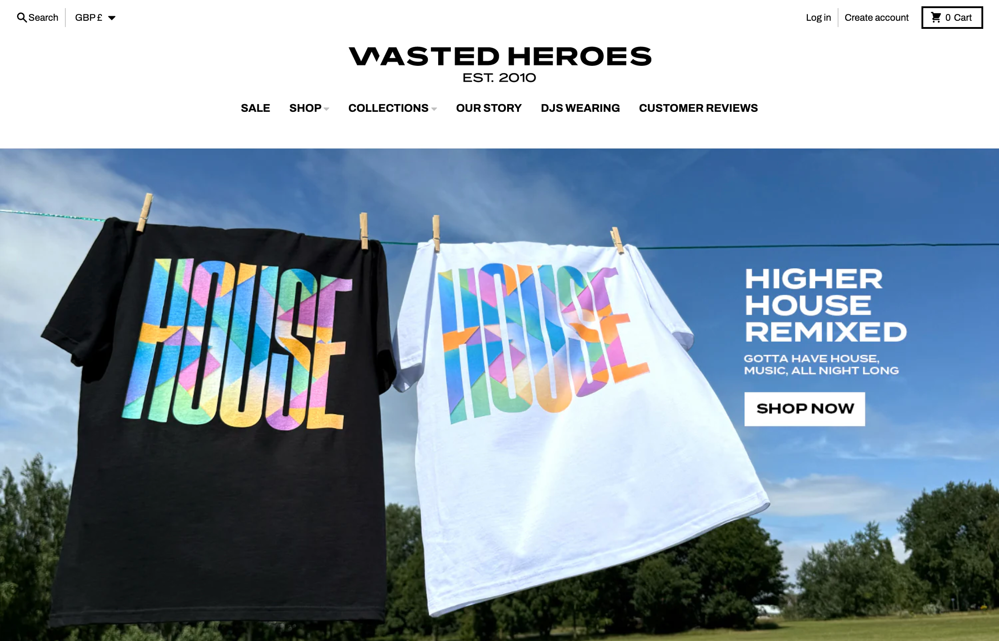

# STRYV – Modern Football Streetwear E-Commerce Platform


A high-performance, production-ready e-commerce platform built with Next.js 14 for STRYV: a football-heritage-inspired streetwear brand. The application features a modern UI, seamless payment integration, and a complete shopping experience.

---

## 📚 Table of Contents

- [Project Overview](#-project-overview)
- [Philosophy](#-philosophy)
- [Features](#-features)
- [Quick Start](#-quick-start)
- [Tech Stack](#-tech-stack)
- [Project Structure](#-project-structure)
- [Setup & Installation](#️-setup--installation)
- [Environment Variables](#-environment-variables)
- [Development](#-development)
- [Deployment](#-deployment)
- [API Documentation](#-api-documentation)
- [Screenshots](#-screenshots)
- [Performance](#-performance)
- [Troubleshooting](#-troubleshooting)
- [Contributing](#-contributing)
- [Project Status & Roadmap](#-project-status--roadmap)
- [Security](#-security)
- [License](#-license)
- [Links](#-links)
- [Support](#-support)

---

## 🎯 Project Overview

STRYV is a full-stack e-commerce platform that combines modern web technologies with a premium shopping experience. The platform includes:

- **Landing Page** with cinematic hero animations and parallax effects
- **Product Catalog** with dynamic collections (Vintage & Iconic Moments)
- **Shopping Cart** with persistent state management
- **Wishlist** functionality
- **Checkout System** with SSLCommerz payment gateway integration
- **Admin Dashboard** for product management (read-only, full CRUD planned)
- **Product Detail Pages** with static generation
- **Responsive Design** optimized for all devices

---

## ⚽ Philosophy

Football heritage is texture, rhythm, emotion — not just merchandise.  
STRYV's tech stack is designed with the same principles:

- **Speed as a competitive advantage** – every interaction should feel instant.
- **Emotion through motion** – animations tell the story of the brand, not just decorate it.
- **Reliability under pressure** – checkout has to perform like a 90th‑minute penalty.
- **Brand-first architecture** – the technology exists to amplify the identity of STRYV.

---

## ✨ Features

### 🎨 Landing Page Experience

- **Sticky Hero Section** with cinematic animations
- **Parallax Story Section** powered by Framer Motion
- **Product Collections**:
  - Vintage Collection
  - Iconic Moments Collection
- **Testimonials Section** with customer reviews
- **Smooth Scrolling** with Lenis integration

### 🛒 Shopping Features

- **Add to Cart** - Add products with size selection
- **Cart Drawer** - Slide-out cart interface
- **Quantity Management** - Update item quantities
- **Persistent Cart** - Cart state saved to localStorage
- **Cart Page** - Dedicated cart management page
- **Wishlist** - Save favorite products
- **Product Detail Pages** - Individual product pages with static generation

### 💳 Payment & Checkout

- **Multi-Payment Methods**:
  - Credit/Debit Card (SSLCommerz)
  - Cash on Delivery
  - Bkash
  - Bank Transfer
- **SSLCommerz Integration** - Full payment gateway integration
- **IPN Handler** - Real-time payment status updates
- **Checkout Flow**:
  - Customer information collection
  - Payment method selection
  - Secure payment processing
  - Success/Failure/Cancel handling

### 👨‍💼 Admin Features

- **Admin Dashboard** - Product management interface (read-only)
- **Product Listing** - View all products in a table
- **Product Statistics** - Total product count
- **Future**: Full CRUD operations, image uploads, analytics, and RBAC (see [ROADMAP.md](./ROADMAP.md))

### 📱 User Experience

- **Responsive Design** - Mobile-first approach
- **Fast Navigation** - Optimized routing with Next.js
- **Image Optimization** - Automatic image optimization with Next/Image
- **SEO Optimized** - Metadata and Open Graph tags
- **Accessibility** - ARIA labels and semantic HTML

---

## ⚡ Quick Start

Get STRYV running locally in minutes:

```bash
# Clone and install
git clone <repository-url>
cd STRYV
npm install

# Set up environment
cp .env.example .env.local
# Edit .env.local with your SSLCommerz credentials

# Run development server
npm run dev
```

Visit [http://localhost:3000](http://localhost:3000)

📖 [Full setup guide →](#️-setup--installation)

---

## 🚀 Tech Stack

### Core Framework

- **Next.js 14** (App Router) - React framework with file-based routing and server components
- **React 18** - UI library with latest features
- **TypeScript** - Type-safe development

### Styling & UI

- **Tailwind CSS** - Utility-first CSS framework
- **Framer Motion** - Advanced animations and transitions
- **Lenis Smooth Scroll** - Smooth scrolling experience
- **Lucide React** - Icon library

### State Management

- **React Context API** - Global state for cart and wishlist
- **localStorage** - Persistent client-side storage

### Payment Integration

- **SSLCommerz** - Payment gateway for Bangladesh market
- **IPN (Instant Payment Notification)** - Payment status handling

### Development Tools

- **ESLint** - Code linting
- **Prettier** - Code formatting
- **PostCSS** - CSS processing
- **Autoprefixer** - CSS vendor prefixing

### Deployment

- **Vercel** - Hosting and deployment platform
- **Next.js Image Optimization** - Automatic image optimization

---

## 📁 Project Structure

```text
STRYV/
├── docs/                  # Documentation (architecture, payments, admin)
├── public/                # Static assets
├── scripts/               # Utility scripts
├── src/
│   ├── app/               # Next.js App Router
│   │   ├── (admin)/       # Admin routes
│   │   ├── api/           # API routes (checkout, payment)
│   │   ├── cart/          # Cart page
│   │   ├── checkout/      # Checkout result pages
│   │   ├── products/      # Product detail pages
│   │   ├── wishlist/      # Wishlist page
│   │   ├── layout.tsx     # Root layout
│   │   └── page.tsx       # Landing page
│   ├── components/        # React components
│   │   ├── stryv/         # STRYV specific components
│   │   └── providers.tsx  # Context providers
│   ├── context/           # React Context (Cart, Wishlist)
│   └── lib/               # Utilities and data
│       ├── commerce/      # Checkout logic
│       └── stryv/         # Types and static data
├── .gitignore
├── next.config.js
├── package.json
├── tailwind.config.js
└── tsconfig.json
```

---

## 🛠️ Setup & Installation

### Prerequisites

- **Node.js** 18.17.0 or higher ([download](https://nodejs.org))
- **npm** 9.0.0 or higher (comes with Node.js)
- **Git** ([download](https://git-scm.com))
- **SSLCommerz Account** for payment testing ([sign up](https://merchant.sslcommerz.com/))

### Installation

1. **Clone the repository**

   ```bash
   git clone <repository-url>
   cd STRYV
   ```

2. **Install dependencies**

   ```bash
   npm install
   ```

3. **Set up environment variables**

   Create a `.env.local` file in the root directory. See [Environment Variables](#-environment-variables) section for details.

4. **Run development server**

   ```bash
   npm run dev
   ```

5. **Open your browser**
   Navigate to [http://localhost:3000](http://localhost:3000)

---

## 🔐 Environment Variables

⚠️ **NEVER commit `.env.local` to git**  
⚠️ **Use different credentials for production and development**

### Required Variables

```env
# SSLCommerz Credentials (get from merchant.sslcommerz.com)
SSLCOMMERZ_STORE_ID=your_store_id          # ⚠️ NEVER share publicly
SSLCOMMERZ_STORE_PASSWORD=your_password    # ⚠️ NEVER share publicly
SSLCOMMERZ_IS_LIVE=false                   # "false" for testing, "true" for production
```

For detailed instructions on obtaining credentials and configuring them for Vercel, please refer to [docs/payments-sslcommerz.md](./docs/payments-sslcommerz.md).

---

## 👨‍💻 Development

### Available Scripts

```bash
# Development server
npm run dev          # Start dev server on http://localhost:3000

# Production build
npm run build        # Build for production
npm run start        # Start production server

# Code quality
npm run lint         # Run ESLint
```

### Development Workflow

1. **Create a feature branch**

   ```bash
   git checkout -b feature/your-feature-name
   ```

2. **Make changes and test locally**

   ```bash
   npm run dev
   ```

3. **Lint your code**

   ```bash
   npm run lint
   ```

4. **Commit with conventional commits**

   ```bash
   git commit -m "feat(cart): add quantity update logic"
   ```

### Commit Guidelines

This project uses **Conventional Commits**: `type(scope): description`

- `feat`: Add new feature
- `fix`: Fix a bug
- `docs`: Documentation only
- `style`: Formatting, no code change
- `refactor`: Code restructure
- `perf`: Performance improvement
- `test`: Adding tests
- `chore`: Repo maintenance

For detailed component architecture, please refer to [docs/architecture.md](./docs/architecture.md).

---

## 🚀 Deployment

### Vercel (Recommended)

1. **Install Vercel CLI**

   ```bash
   npm i -g vercel
   ```

2. **Login to Vercel**

   ```bash
   vercel login
   ```

3. **Deploy**

   ```bash
   vercel --prod
   ```

4. **Set Environment Variables**
   - Use Vercel Dashboard: Settings → Environment Variables
   - Or use CLI: `vercel env add`

### Build for Production

```bash
# Build the application
npm run build

# Start production server
npm run start
```

---

## 🔌 API Documentation

The platform includes a robust API for handling payments and checkout flows.

- **Checkout API** (`POST /api/checkout`): Initiates the SSLCommerz payment session.
- **Payment IPN** (`POST /api/payment/ipn`): Handles Instant Payment Notifications for server-side validation.
- **Return Handlers**: Endpoints for success, failure, and cancellation redirects.

For complete API documentation, including request/response examples and integration details, please see [docs/payments-sslcommerz.md](./docs/payments-sslcommerz.md).

---

## 📸 Screenshots

### Landing Page



### Product Catalog


### Product Detail


### Live Demo

🔗 [View Live Demo](https://stryv.vercel.app)

---

## ⚡ Performance

- **Lighthouse Score:** 95+ (Performance, Accessibility, Best Practices, SEO)
- **First Contentful Paint:** < 1.5s
- **Time to Interactive:** < 3.5s
- **Bundle Size:** ~200KB (gzipped)

### Optimizations

- Next.js Image Optimization
- Code splitting with React.lazy
- Static generation for product pages
- Lenis smooth scroll with RAF optimization

---

## 🔧 Troubleshooting

### Payment integration not working

- Verify environment variables are set correctly
- Check `SSLCOMMERZ_IS_LIVE` matches your credentials (sandbox vs live)
- Ensure IPN URL is accessible (not localhost)
- Check Vercel function logs for errors

### Images not loading

- Check `public/images/` directory structure
- Verify image paths in `src/lib/stryv/products.ts`
- Run `npm run build` to test production builds
- Ensure image files exist in the public directory

### Cart not persisting

- Check browser localStorage is enabled
- Clear localStorage: `localStorage.clear()` in browser console
- Check browser console for errors
- Verify CartContext is properly wrapped in Providers

### Build errors

- Clear `.next` directory: `rm -rf .next`
- Delete `node_modules` and reinstall: `rm -rf node_modules && npm install`
- Check Node.js version: `node --version` (should be 18.17.0+)
- Verify TypeScript types: `npm run build`

### Environment variables not loading

- Ensure `.env.local` is in project root (not in `src/`)
- Restart development server after changing `.env.local`
- Check variable names match exactly (case-sensitive)
- For Vercel: verify variables are set in correct environment (production/preview/development)

Need more help? [Open an issue](https://github.com/your-repo/stryv/issues)

---

## 🤝 Contributing

1. Fork the repository
2. Create a feature branch (`git checkout -b feature/amazing-feature`)
3. Make your changes
4. Test thoroughly
5. Commit with conventional commits (see [Commit Guidelines](#commit-guidelines))
6. Push to your branch (`git push origin feature/amazing-feature`)
7. Submit a pull request

For detailed contribution guidelines, see [CONTRIBUTING.md](./CONTRIBUTING.md) (if available).

---

## 📊 Project Status & Roadmap

### ✅ Completed Features

See [Features](#-features) section above.

### 🔄 Recent Updates

- Migrated from Vite to Next.js 14 (App Router)
- Implemented SSLCommerz payment gateway
- Added wishlist functionality
- Created admin dashboard foundation
- Added product detail pages
- Improved checkout flow

### 📋 Future Features

See [ROADMAP.md](./ROADMAP.md) for planned features and enhancements.

**Note**: The admin dashboard currently provides read-only product listing. Full CRUD operations, image uploads, analytics, and RBAC are planned for future releases.

### 📚 Documentation

#### Setup & Deployment

- [QUICK_SETUP.md](./QUICK_SETUP.md) - Quick setup guide
- [VERCEL_ENV_SETUP.md](./VERCEL_ENV_SETUP.md) - Vercel environment setup

#### Architecture & Technical

- [docs/architecture.md](./docs/architecture.md) - Data flow, rendering strategy, checkout pipeline
- [docs/payments-sslcommerz.md](./docs/payments-sslcommerz.md) - Payment integration, IPN, security notes
- [docs/admin.md](./docs/admin.md) - Admin dashboard documentation

#### Project Management

- [ROADMAP.md](./ROADMAP.md) - Planned features and roadmap
- [PROJECT_STATUS.md](./PROJECT_STATUS.md) - Detailed project status
- [ORGANIZATION_SUMMARY.md](./ORGANIZATION_SUMMARY.md) - Repository organization

---

## 🔒 Security

- Environment variables stored securely (e.g. Vercel encrypted env)
- Payment credentials are never committed to git
- HTTPS enforced in production
- Input validation in API routes
- Payment processing logic kept server-side
- Security headers configured in `vercel.json`

---

## 📄 License

MIT

---

## 🔗 Links

- **Live Site**: [https://stryv.vercel.app](https://stryv.vercel.app)
- **SSLCommerz**: [https://sslcommerz.com](https://sslcommerz.com)
- **Vercel**: [https://vercel.com](https://vercel.com)
- **Roadmap**: [ROADMAP.md](./ROADMAP.md)

---

## 📞 Support

For issues or questions:

- Check existing documentation files
- Review API route implementations
- Check Vercel function logs for errors
- [Open an issue](https://github.com/your-repo/stryv/issues) on GitHub

---

## ❓ FAQ

**Q: Can I use this in production?**  
A: Yes! The platform is production-ready. Ensure you configure live SSLCommerz credentials and set `SSLCOMMERZ_IS_LIVE=true`.

**Q: Is there a demo with test credentials?**  
A: Visit [https://stryv.vercel.app](https://stryv.vercel.app) - use SSLCommerz sandbox test cards for testing.

**Q: How do I add new products?**  
A: Currently, products are in `src/lib/stryv/products.ts`. Admin CMS with full CRUD is planned for v2 (see [ROADMAP.md](./ROADMAP.md)).

**Q: Can I use a different payment gateway?**  
A: The current implementation is tightly integrated with SSLCommerz. To use another gateway, you'll need to modify the checkout API and payment handlers.

**Q: How do I customize the design?**  
A: The design uses Tailwind CSS. Modify components in `src/components/stryv/` and update styles in `tailwind.config.js`.

---

**Built with ❤️ for STRYV – where football heritage meets modern streetwear engineering.**
